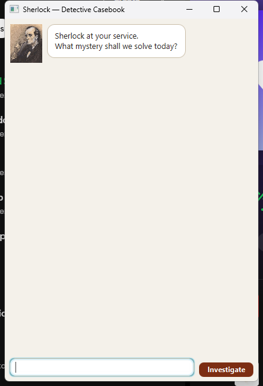

# Sherlock User Guide

Sherlock is a detective-themed desktop task manager that keeps your todos, deadlines, and events in one casebook.
Type a command in the box at the bottom of the window and press <kbd>Enter</kbd> or click **Investigate**.

## Quick start

1. Ensure that Java 25 is installed.
2. Download `sherlock.jar` from the latest GitHub release.
3. Open a terminal in the folder containing the JAR.
4. Run `java -jar sherlock.jar`.
5. Type `help` at any time to see the in-app command summary.

Sherlock saves tasks automatically in `data/sherlock.txt`, relative to the folder from which the app is run.

## Commands

Words in `UPPER_CASE` are values that you supply. Task numbers are the numbers displayed by `list`.

### View all tasks: `list`

Shows every task in the casebook with its task number and completion status.

### Add a todo: `todo DESCRIPTION`

Example: `todo question the witness`

### Add a deadline: `deadline DESCRIPTION /by yyyy-MM-dd`

Dates must use the year-month-day format and must be valid calendar dates.

Example: `deadline submit report /by 2026-09-18`

### Add an event: `event DESCRIPTION /from START /to END`

`START` and `END` are displayed exactly as entered, so concise values are easiest to read.

Example: `event interview witness /from Monday 2pm /to Monday 3pm`

### Mark a task complete: `mark NUMBER`

Example: `mark 2`

### Mark a task incomplete: `unmark NUMBER`

Example: `unmark 2`

### Delete a task: `delete NUMBER`

Example: `delete 3`

After deletion, use `list` again because the remaining task numbers may have changed.

### Find tasks: `find KEYWORD`

Searches task descriptions without regard to letter case.

Example: `find witness`

### Show help: `help`

Displays a compact list of commands inside Sherlock.

### Exit: `bye`

Shows Sherlock's farewell and closes the application.

## Input and error handling

Leading, trailing, and extra spacing around `/by`, `/from`, and `/to` is accepted. Sherlock highlights invalid commands in red and explains how to correct them. If the saved-data file is missing, Sherlock creates it automatically; if it cannot be read, Sherlock reports the problem and starts with an empty in-memory casebook.

## Symbols

- `[T]`, `[D]`, and `[E]` identify todos, deadlines, and events.
- `[ ]` means incomplete.
- `[X]` means complete.

## Image credits

The Sherlock Holmes and user portraits are public-domain illustrations by Sidney Paget, obtained from Wikimedia Commons.
